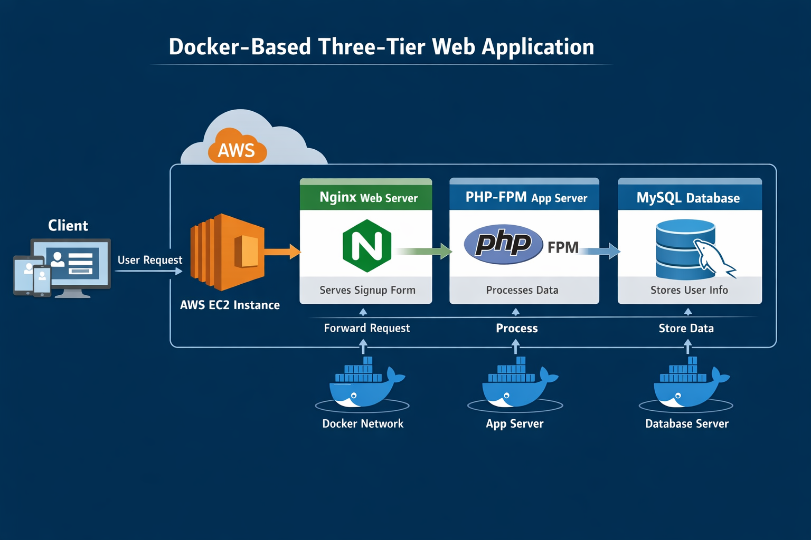

# 2-Tier Architecture Microservice Deployment using Docker, Nginx (Proxy Pass) & Node.js

## Project Overview

This project demonstrates a 2-tier architecture microservice deployed using Docker.
The frontend requests are handled by Nginx, which acts as a reverse proxy (proxy_pass) and forwards traffic to a Node.js backend service running in a separate container.

The entire application is containerized using Dockerfile, making it portable, scalable, and easy to deploy.

## Architecture Overview (2-Tier)
### Tier 1 – Proxy / Web Layer

- Nginx

- Acts as a reverse proxy

- Routes client requests to backend services using proxy_pass

### Tier 2 – Application Layer

- Node.js microservice

- Handles backend logic and API responses

## Flow:
  
    Client → Nginx (Reverse Proxy) → Node.js Application

## Technologies Used

- Docker

- Dockerfile

- Nginx

- Node.js

- Reverse Proxy (proxy_pass)

- Linux (Ubuntu / Amazon Linux)

## Project Structure

      2tier-microservice/
      │
      ├── nginx/
      │   ├── nginx.conf
      │   └── Dockerfile
      │
      ├── node-app/
      │   ├── app.js
      │   ├── package.json
      │   └── Dockerfile
      │
      ├── Img/
      │   ├── app-output.png
      │   ├── docker-ps.png
      │   └── architecture.png
      │
      └── README.md

## Dockerfile Explanation
### Node.js Dockerfile

- Uses Node base image

- Copies application files

- Installs dependencies

- Exposes application port

- Starts Node.js server

### Nginx Dockerfile
## EC2 instance running state
 .png)

- Uses Nginx base image

- Copies custom nginx.conf

- Configures proxy_pass to Node.js container

## Nginx Reverse Proxy Configuration (Example)

    server {
        listen:80;
    
       location / {
          root  /usr/share/nginx/html;
          index index.html index.htm;
          proxy_pass http://nodeapp:3000;
        }
    }

nodeapp is the container name of the Node.js service.

## Dockerfile

    FROM node
    WORKDIR /nodeapp
    COPY . .
    RUN npm install package.json
    EXPOSE 3000
    CMD ["node", "app.js"]

## How to Run the Project

### 1. Build Node.js Image

     docker build -t node-app .

### 2. Build Nginx Image

     docker build -t nginx-proxy .

### 3. Run Node.js Container

     docker run -d --name nodeapp nodeimg

### 4. Add a Proxy_Pass In Conf File

### 5. Run Nginx Container

    docker run -d -p 80:80 --name nodeapp --link nodeapp nginx

## Access Application

### Open your browser and visit:

     http://<server-ip>
     
### Example:
    http://54.177.53.34

## Output:

You will see the Node.js application response routed through Nginx reverse proxy.

## Key Features

- Microservice-based architecture

- Reverse proxy using Nginx

- Containerized deployment

- Easy scalability

- Clean separation of concerns

## Use Cases

- Learning Docker microservices

- Understanding reverse proxy

- DevOps practice projects

- Cloud & container deployments

## Conclusion

This project demonstrates how to deploy a 2-tier microservice architecture using Docker, Nginx proxy_pass, and Node.js.
It showcases real-world DevOps concepts such as containerization, reverse proxying, and service isolation.

## Author

Pooja Jadhav

Github: https://github.com/mansikadam1100

