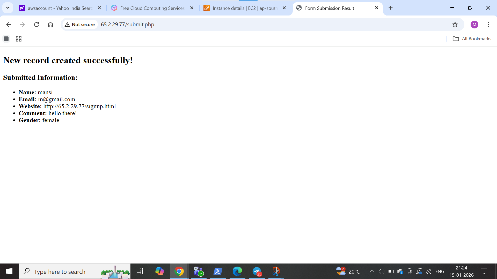

# Docker-Based-Three-Tier-Web-Application

## Project Summary

This project showcases the deployment of a Three-Tier Web Application using Docker and Docker Compose on an AWS EC2 instance.
It follows a clean, modular, and production-style architecture where each layer runs in its own container.

The objective of this project is to understand containerized application design, service isolation, and inter-container communication in a real-world scenario.

## Application Architecture
 ### Layers Involved :

### 1. Presentation Layer (Nginx)

- Hosts and serves the HTML signup form

### 2. Application Layer (PHP-FPM)

- Handles form data and business logic

### 3. Data Layer (MySQL)

- Stores user information persistently

## Request Flow

     Client Browser
        ↓
     Nginx Web Server
        ↓
     PHP-FPM Backend
        ↓
     MySQL Database

## Project Structure

     threetier/
     │
     ├── web/
     │   ├── code/
     │   │   └── signup.html
     │   └── config/
     │       └── default.conf
     │
     ├── app/
     │   └── code/
     │       └── submit.php
     │
     ├── db/
     │   ├── Dockerfile
     │   └── init.sql
     │
     └── docker-compose.yml

## Tech Stack Used

| Technology     | Usage                 |
| -------------- | --------------------- |
| Docker         | Containerization      |
| Docker Compose | Service orchestration |
| Nginx          | Web server            |
| PHP-FPM        | Backend processing    |
| MySQL          | Relational database   |
| AWS EC2        | Cloud deployment      |

## Docker Implementation

- MySQL database auto-initialized using init.sql

- Separate containers for each tier

- Persistent volume attached to database container

- Custom Docker networks for better isolation

- Service startup order handled using depends_on

- All services managed through a single docker-compose.yml

## Deployment Steps
| Step | Action                     | Command                       |
| ---- | -------------------------- | ----------------------------- |
| 1    | Create project folders     | `mkdir web app db`            |
| 2    | Configure Nginx & PHP      | Add HTML & PHP files          |
| 3    | Setup MySQL initialization | Create SQL schema             |
| 4    | Launch application         | `docker compose up -d`        |
| 5    | Check containers           | `docker ps`                   |
| 6    | Access application         | `http://13.57.5.144/signup.html` |
| 7    | Submit form                | Fill user details             |
| 8    | Verify database            | `SELECT * FROM users;`        |

## Database Configuration

 Database Name: FCT

Table Name: users

### Table Fields

id

name

email

website

comment

gender

## Application Output

### 1. Project Directories
 

### 2. Nginx Container

### 3. Run Docker Compose Up

### 4. Signup Form

.png)

### 5. Submit 

### 6. MySQL Database

## Key Learnings
| Area           | Skills Gained                  |
| -------------- | ------------------------------ |
| Docker         | Container lifecycle management |
| Docker Compose | Multi-service deployment       |
| Architecture   | Three-tier application design  |
| Networking     | Docker bridge networks         |
| Storage        | Persistent volumes             |
| Backend        | PHP–MySQL integration          |
| Cloud          | Hosting on AWS EC2             |

## Conclusion
This project demonstrates a complete Dockerized three-tier web application with proper separation of web, application, and database layers. It provides practical experience in Docker Compose orchestration, container networking, persistent storage, and AWS EC2 deployment, reflecting a real-world production-style setup.

## Author

Mansi Kadam

Github : https://github.com/mansikadam1100

Medium: https://medium.com/@mansikadam1100

